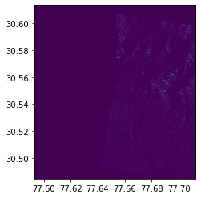
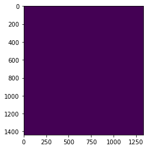

# Sentinel SAR image - Python - Flood Analysis

#### coding is a lot easier with knowledge available - for the list of references scroll to the bottom

```python
#import the python modules for sar preprocessing
```


```python
from snappy import HashMap
from snappy import ProductIO
from snappy import jpy
import os,gc
from snappy import GPF

```


```python
# initialize GPF and read the input file which was downloaded from Copernicus website
```


```python
GPF.getDefaultInstance().getOperatorSpiRegistry().loadOperatorSpis()
Hashmap = jpy.get_type('java.util.HashMap')

path = "data/input/"
opath = "data/output/"
folder = "S1A_IW_GRDH_1SDV_20190821T004329_20190821T004354_028660_033E51_6F6F.SAFE"
gc.enable()
imagepath = path + folder + "\\"
output = opath + "\\"
timestamp = folder.split('_')[4]
date = timestamp[:8]

s1_org = ProductIO.readProduct(imagepath + "\\manifest.safe")

orbit = s1_org.getMetadataRoot().getElement('Abstracted_Metadata').getAttribute('PASS').getData()
look = s1_org.getMetadataRoot().getElement('Abstracted_Metadata').getAttribute('antenna_pointing').getData()

# check the file has been read and print some basic details 
print(s1_org)
print(orbit)
print (look)

width = s1_org.getSceneRasterWidth()
height = s1_org.getSceneRasterHeight()
bands = s1_org.getBandNames()
print (width)
print (height)
print (list(bands))
```

    org.esa.snap.core.datamodel.Product[name=S1A_IW_GRDH_1SDV_20190821T004329_20190821T004354_028660_033E51_6F6F]
    DESCENDING
    right
    25381
    16756
    ['Amplitude_VH', 'Intensity_VH', 'Amplitude_VV', 'Intensity_VV']
    


```python
# first calibrate then subset then terrain correction
# iterate on the polarizations

pols = ['VH','VV']
    
for p in pols:
    polarization = p
        
    parameters = HashMap()
    parameters.put('outputSigmaBand',True)
    parameters.put('sourceBands','Intensity_'+ polarization)
    parameters.put('selectedPolarizations' , polarization)
    parameters.put('outputImageScaleInDb', False)
        
    s1_calib = GPF.createProduct('Calibration',parameters,s1_org)
        
    #s1_calib_bd = output + date + "_calibrate_" + polarization
        
    #ProductIO.writeProduct(s1_calib,s1_calib_bd, 'BEAM-DIMAP')
        
    print (s1_calib)
    
    # our Area of Interest is Uttarkashi district so use the coordinates to create geometry to pass to GPF 
    
    WKTReader = jpy.get_type('com.vividsolutions.jts.io.WKTReader')

    lon_min = 77.5
    lat_min = 30.5
    lon_max = 78.5
    lat_max = 31.5

    wkt = "POLYGON((77.5 30.5, 77.7 30.5, 77.7 30.6 , 77.5 30.6 , 77.5 30.5))"
    geom = WKTReader().read(wkt)

    parameters = HashMap()
    parameters.put('copyMeta', True)
    parameters.put('geoRegion', geom)
    parameters.put('outputImageScaleinDB', False)

    s1_subset = GPF.createProduct('Subset',parameters,s1_calib)

    print (s1_subset)

       ### TERRAIN CORRECTION
 
    parameters = HashMap()     
    parameters.put('demResamplingMethod', 'NEAREST_NEIGHBOUR') 
    parameters.put('imgResamplingMethod', 'NEAREST_NEIGHBOUR') 
    parameters.put('demName', 'SRTM 3Sec') 
    parameters.put('pixelSpacingInMeter', 10.0) 
    parameters.put('sourceBands', 'Sigma0_' + polarization)
 
    terrain = output + date + "_corrected_" + polarization 
    target_2 = GPF.createProduct("Terrain-Correction", parameters, s1_subset) 
    ProductIO.writeProduct(target_2, terrain, 'GeoTIFF')
    
    
    
del s1_org
del s1_subset

```

    org.esa.snap.core.datamodel.Product[name=S1A_IW_GRDH_1SDV_20190821T004329_20190821T004354_028660_033E51_6F6F_Cal]
    org.esa.snap.core.datamodel.Product[name=Subset_S1A_IW_GRDH_1SDV_20190821T004329_20190821T004354_028660_033E51_6F6F_Cal]
    org.esa.snap.core.datamodel.Product[name=S1A_IW_GRDH_1SDV_20190821T004329_20190821T004354_028660_033E51_6F6F_Cal]
    org.esa.snap.core.datamodel.Product[name=Subset_S1A_IW_GRDH_1SDV_20190821T004329_20190821T004354_028660_033E51_6F6F_Cal]
    


```python
# we will be using rasterio python library built on top of gdal for raster processing

import rasterio as rio
from rasterio.plot import show

```


```python
# open the image and view 

opath = "data/output/"
output = opath + "\\"

readImageVH = rio.open(output + "20190821_corrected_VH.tif")
readImageVV = rio.open(output + "20190821_corrected_VV.tif")
```


```python
import matplotlib.pyplot as plt

%matplotlib inline

show(readImageVV)
show(readImageVH)


```





    <matplotlib.axes._subplots.AxesSubplot at 0xf88e4c4a90>


```python
readImageVH.profile
```


    {'driver': 'GTiff', 'dtype': 'float32', 'nodata': None, 'width': 1329, 'height': 1436, 'count': 1, 'crs': CRS.from_epsg(4326), 'transform': Affine(8.983152841195215e-05, 0.0, 77.59308833731157,
           0.0, -8.983152841195215e-05, 30.613623314351166), 'tiled': False, 'interleave': 'band'}


```python
# create a false clor composite using the polarisation bands as input
fc = output + "falsecolor.tif"

with rio.open(fc,'w',driver = 'Gtiff', width = readImageVH.width
                       ,height = readImageVH.height
                      ,count =2
                      ,crs = readImageVH.crs
                      ,transform = readImageVH.transform
                      ,dtype = 'float64') as falsecolor:
    
    falseColor.write(readImageVH.read(1),2)
    falseColor.write(readImageVV.read(1),1)

showImg = rio.open(fc)
#fc1 = showImg.read(1)
show(fc1)


```





    <matplotlib.axes._subplots.AxesSubplot at 0xf88bd9cb70>

### to be continued - creating rgb using VV,VH and VV/VH bands
### water delineation to study impact

#### references
--flood delineation using snap and python
https://www.researchgate.net/publication/327972406_Flood_Delineation_of_Synthetic_Aperture_Radar_data_using_python

--snappy esa forum and communtity
https://forum.step.esa.int/

--snappy python pre processing
http://remote-sensing.eu/preprocessing-of-sentinel-1-sar-data-via-snappy-python-module/

--sar interpretation layman
http://ceos.org/document_management/SEO/DataCube/Laymans_SAR_Interpretation_Guide_2.0.pdf


